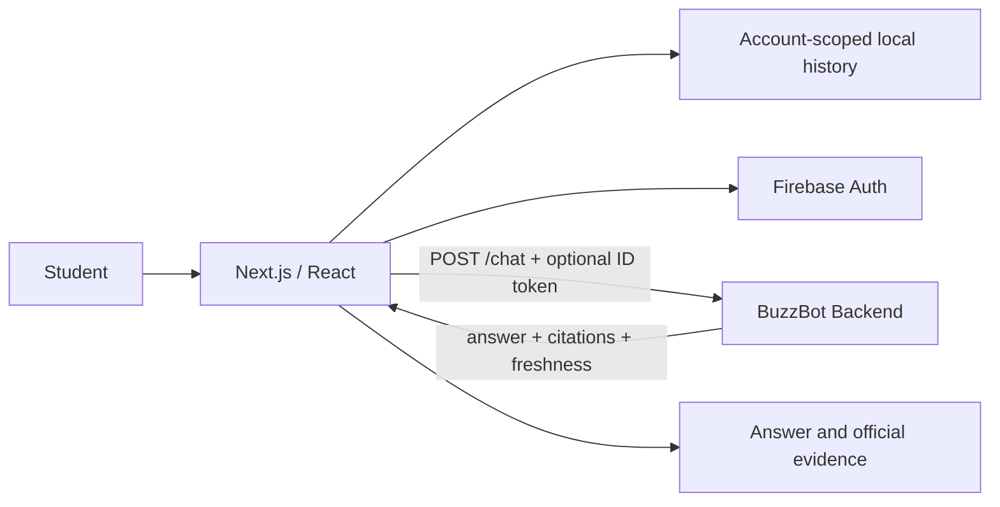

# BuzzBot Web

> Evidence-first chat interface for a Georgia Tech student assistant.

BuzzBot Web is the Next.js client for BuzzBot, a conversational assistant built around official Georgia Tech course, schedule, calendar, and policy data. The frontend is designed to keep the answer, its sources, and freshness context together so students can verify important information before acting on it.

The companion backend handles retrieval, validation, and citation generation; this repository focuses on the product experience, authentication boundary, conversation state, and browser-side reliability.

## Highlights

- **Grounded chat UX** — renders backend answers with official citations, source excerpts, confidence/freshness metadata, and compact expandable source lists.
- **Resumable conversations** — persists local chat history, restores threads, groups recent conversations, and supports search and pinning.
- **Account-scoped history** — Firebase-authenticated users get UID-scoped local storage with one-time migration from anonymous history.
- **Request-time authentication** — Firebase ID tokens are obtained immediately before authenticated API requests and are not manually persisted by the application.
- **Responsive, accessible interface** — keyboard-visible focus states, practical touch targets, responsive history navigation, and reduced visual noise around the conversation.
- **Deterministic release checks** — linting, type checking, unit tests, production build verification, and mocked Playwright flows run without production credentials.

## Architecture



Conversation history intentionally remains in the browser. Authentication identifies requests to the backend, but BuzzBot Web does not provide cloud-synced chat history or store Firebase credentials itself.

## Frontend structure

```text
src/app/                         Next.js application shell
src/components/buzzbot/          Chat, history, auth, evidence, and account UI
src/components/buzzbot/chat-api.ts
                                 Typed backend client and response handling
src/components/buzzbot/chat-storage.ts
                                 Bounded browser persistence and account isolation
tests/                           Vitest + Testing Library coverage
e2e/                             Playwright browser flows
```

## Tech stack

| Area | Technology |
| --- | --- |
| Framework | Next.js 16, React 19, TypeScript |
| Authentication | Firebase Authentication |
| UI | CSS Modules, Lucide React |
| Unit / component tests | Vitest, Testing Library |
| Browser tests | Playwright |
| Quality gates | ESLint, TypeScript, production build |

## Local development

Requirements: **Node.js 22+** and a running BuzzBot API.

```bash
npm ci
cp .env.example .env.local
npm run dev
```

The app runs at `http://localhost:3000`. Set `NEXT_PUBLIC_BUZZBOT_API_URL` to the backend origin. Firebase email/password authentication is optional; configure the public `NEXT_PUBLIC_FIREBASE_*` Web App values to enable it.

Run the local verification gates with:

```bash
npm run verify
npm run test:e2e
```

`npm run verify` runs ESLint, TypeScript checking, unit tests, and a production build.

## Data and security boundaries

- Chat history is stored only in the current browser's `localStorage` and is bounded before persistence.
- Signed-in and anonymous histories use separate storage keys.
- Firebase ID tokens are attached at request time rather than copied into application storage.
- `NEXT_PUBLIC_*` values are browser configuration only; private API keys or Firebase Admin credentials do not belong in this repository.
- The browser consumes citations and freshness metadata produced by the backend instead of inventing source attribution client-side.

## Project scope

BuzzBot Web is the user-facing half of the BuzzBot project. The backend repository contains the evidence-first retrieval workflow, structured OSCAR queries, official-document search, ingestion, evaluation, and runtime trust boundaries.
